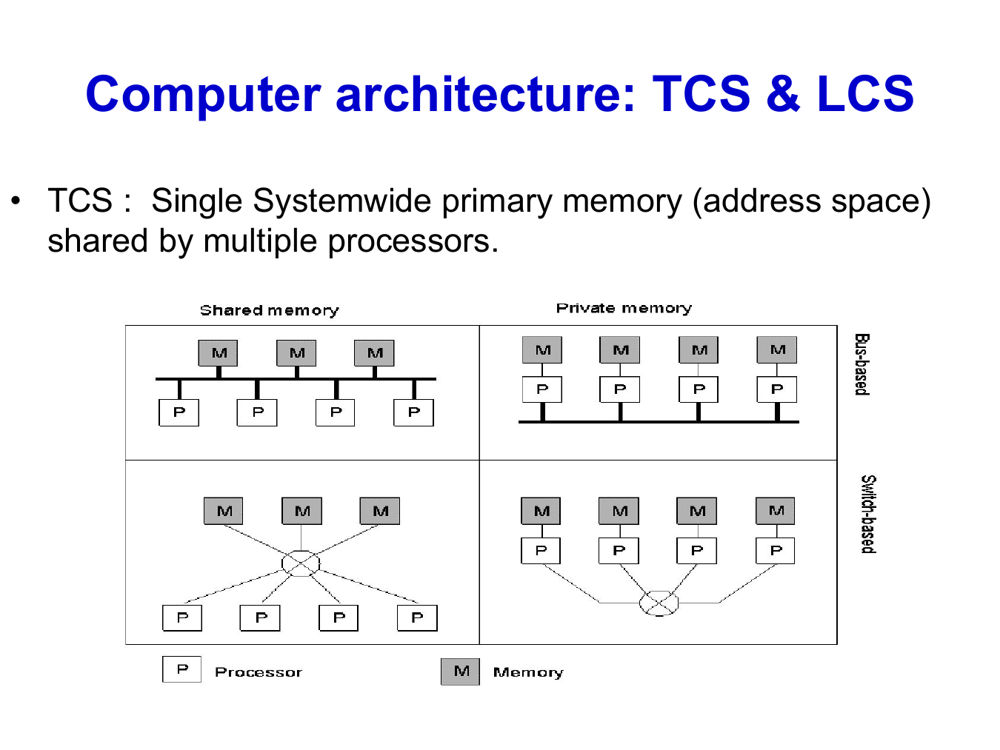
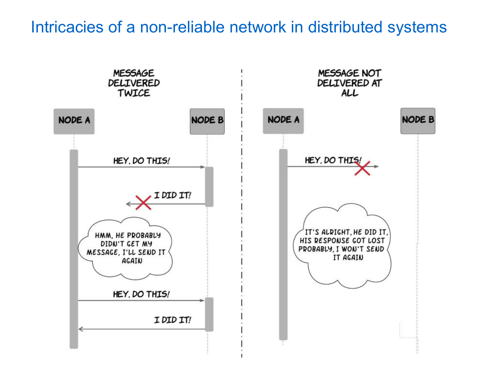

# Fundamental concepts

## 1. Distributed systems

A distributed system is a collection of autonomous computing components that coordinate to achieve a common goal. In the usual loosely coupled model, each machine has its own memory and clock and communicates through a network. Tightly coupled distributed architectures may instead use shared memory.

Distributed computing focuses on algorithms and coordination. A distributed system also includes the operating systems, middleware, naming, storage, security, administration, and failure handling that make those algorithms usable.

## 2. Motivation for distributed computation

- **Resource sharing:** many computers can use the same files, database, storage, or printer.
- **Faster processing:** machines can work on different parts of a task simultaneously.
- **Geographic distribution:** computers in different places can work together, such as bank branches and ATMs.
- **Scalability:** capacity can be increased by adding more machines.
- **Resilience:** redundancy can preserve correctness (fault tolerance), keep the service accessible (availability), and allow failed components to rejoin safely (recoverability).
- **Naturally distributed applications:** banking, delivery apps, and sensor networks already operate in many locations.

## 3. Coupling and system software

Distributed-system architecture has two aspects: how the hardware components communicate and how the software presents them to users.

### Hardware coupling

In a **tightly coupled system**, several processors share one memory space. They communicate by reading and writing shared data. A multicore server is a common example.

In a **loosely coupled system**, every computer has its own memory. Since one computer cannot directly access another's memory, the machines communicate by sending messages over a network. A server cluster is loosely coupled.

*The upper diagrams use a shared bus; the lower diagrams use a switch. The main distinction is shared memory versus private memory.*

### System software

A **distributed operating system** manages several machines as one system. It hides machine boundaries and may decide where a program or resource should run.

A **network operating system** keeps the machines visible as separate systems. Users access remote resources explicitly, for example through SSH or a network file share.

**Middleware** runs above the operating systems and provides common distributed services such as RPC, messaging, naming, and transactions. It gives applications a uniform interface even when the underlying machines and operating systems differ.

Most distributed systems use loosely coupled hardware, while the operating system or middleware determines how much of that distribution is visible. An **open** system uses published interfaces and standard protocols so independently developed components can interoperate or be replaced.

## 4. Transparency

Transparency hides selected details of distribution so users can work with the resources as one coherent system. Each type identifies a detail that the user or program does not need to manage directly.

| Transparency | What is hidden | Simple example |
|---|---|---|
| Access | Local/remote access differences | The same `open/read` operations work for local and remote files. |
| Location | Physical location | A resource name stays unchanged when its server changes. |
| Replication | Multiple copies | Several database replicas appear as one database. |
| Failure | Component failure and recovery | Another replica serves requests after one server crashes. |
| Migration | Movement to another node | A service moves without changing its name or access method. |
| Concurrency | Simultaneous users | Concurrent operations preserve ordering, mutual exclusion, and progress. |
| Performance | Internal reconfiguration | Requests move to a less-loaded server automatically. |
| Scaling | Changes caused by growth | Servers are added without changing client programs. |

Making a remote service look local is useful, but it still depends on a network. If the network is cut, the system must wait, report an error, or use an older replica; failure transparency cannot be perfect.

## 5. Computation models

A computation model is the contract under which an algorithm is designed and proved. Its assumptions determine which behaviours the algorithm must handle.

### Message-passing model

Each process has private state and communicates by sending messages. The network graph determines which processes can communicate directly; channel reliability, ordering, and timing are separate assumptions. Precise execution events are introduced with the message-passing algorithms.

### Shared-memory model

Processes communicate by reading and writing shared registers or objects. **Atomicity** means each operation appears to occur as one indivisible action, even when operations overlap. A distributed shared-memory abstraction may be implemented over messages, but an algorithm must use the guarantees provided by the abstraction.

The basic idea is simple: one process may write `ready = true` and another may read it. The consistency rule determines what the reader is allowed to observe when reads and writes overlap.

### Synchronous model

A synchronous system has known upper bounds on processing time ($\Phi$) and message delay ($\Delta$). Algorithms can therefore run in rounds: compute, send the round's messages, wait long enough to receive them, and update local state.

These bounds make timeouts meaningful. If a request and reply each take at most $\Delta$, and processing takes at most $\Phi$, then no reply after $2\Delta+\Phi$ indicates that some assumption has failed. With reliable channels, this can be treated as a process crash. Round complexity measures how many such rounds an algorithm needs; message complexity measures how much communication it performs.

### Asynchronous model

An asynchronous system has no known upper bound on processing or message delay. Correct processes are still expected to keep running and messages on reliable channels are eventually delivered, but either may be delayed for an arbitrarily long time.

Therefore, silence is ambiguous: a process may have crashed, or its reply may simply be late. No finite timeout can distinguish the two with certainty. This is also the basis of the **FLP result**: deterministic consensus cannot guarantee termination in a fully asynchronous system if even one process may crash.

### Partial synchrony

Practical systems are usually **partially synchronous**: delays may be unpredictable at first, but eventually remain within some bound. Protocols use increasing timeouts until one exceeds the real delay. They preserve safety even during unstable periods and guarantee progress once the network becomes stable long enough.

In short: synchrony makes silence evidence of failure, asynchrony makes silence ambiguous, and partial synchrony makes timeouts reliable eventually.

## 6. Network and failure assumptions

An algorithm's system model should specify:

- Topology: complete, ring, tree, or arbitrary connected graph
- Direction: uni- or bidirectional links
- Delivery: reliable/unreliable; FIFO/non-FIFO
- Addressing: unique process identifiers or anonymous nodes
- Knowledge: $n$, diameter, neighbors, or topology known/unknown
- Timing: synchronous, asynchronous, or partial synchrony
- Failure: fail-stop, crash-recovery, omission, link failure, or Byzantine

An algorithm proved under reliable FIFO channels is not automatically correct with non-FIFO delivery.

Failure types differ: **fail-stop** means a process stops and the failure is detectable; **crash-recovery** allows it to restart; **omission** loses an action or message; **Byzantine** behavior can be arbitrary or malicious.

Distributed designs must not assume that the network is always reliable, instantaneous, unlimited in bandwidth, secure, free to use, fixed in topology, homogeneous, or controlled by one administrator. These common network fallacies explain why communication and failure assumptions must be explicit.

*A lost reply creates ambiguity: retrying may execute an operation twice, while not retrying may leave it incomplete.*

## 7. Complexity measures

- **Message complexity:** total messages sent in the worst case.
- **Bit complexity:** total number of bits; important when messages carry growing vectors or paths.
- **Round complexity:** synchronous rounds until termination.
- **Causal-chain/asynchronous time:** longest dependent sequence of message deliveries, when explicitly defined.
- **Space complexity:** local state per process and any network-wide state.
- **Response time:** request to completion.
- **Synchronization delay:** delay between one process leaving a critical section and the next entering.

A pure asynchronous model provides no wall-clock bound. A tree broadcast uses $n-1$ messages and has a causal path of depth $d$, but an adversary may delay any delivery for an arbitrarily long real time.

## 8. Proving correctness

Split the proof into properties.

### Safety

Nothing bad happens. For example, two processes must not choose conflicting outcomes.

Safety is commonly proved using an invariant preserved by every event.

### Liveness

Something good eventually happens. For example, a valid request eventually completes.

Liveness depends on explicit progress, fairness, and delivery assumptions.

### Termination

Every admissible execution eventually reaches a terminal condition. An algorithm may satisfy safety but not termination after a crash.

Termination is one specific liveness property: it says the whole algorithm eventually finishes, while other liveness properties may only promise that useful events continue occurring.

### Standard proof pattern

1. State the invariant.
2. Prove it initially.
3. Prove each event preserves it.
4. Derive safety from the invariant.
5. Use fairness/delivery and a decreasing measure or progress argument for liveness.

## 9. Scalability

Three distinct problems:

- **Size:** centralized data/servers become bottlenecks.
- **Geography:** WAN latency and reliability differ from a LAN.
- **Administrative domains:** trust, policy, naming, and payment differ.

Scalable designs avoid a single required global view, distribute metadata, cache or replicate carefully, use hierarchy, and keep common operations local.

## Source

Primary supplied material: [Introduction to Distributed Computing](../sources/01_Introduction-DC.pdf).
