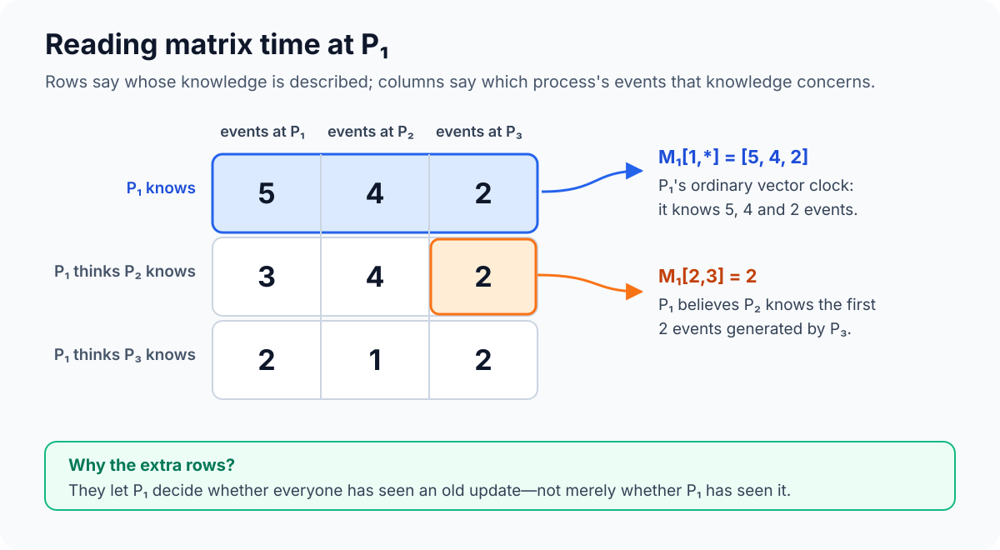

# Clocks and event ordering

Replicas can receive the same updates in different orders and finish in different states, making event ordering a correctness concern.


## 1. Physical clocks

Let $C_i(t)$ be process $i$'s clock reading at real time $t$.

- **Offset or skew:** difference between two clock readings at one instant.
- **Drift rate:** difference between a clock's rate and real time.
- **External synchronization:** $|C_i(t)-UTC(t)|\le D$.
- **Internal synchronization:** $|C_i(t)-C_j(t)|\le D$ for all $i,j$.

External synchronization within $D$ implies pairwise disagreement of at most $2D$. Internal synchronization alone gives no guarantee about UTC.


*A rate error accumulates, so clock offset grows between synchronizations.*

### Cristian's method

A client sends a request at local time $t_0$, receives the server's timestamp $T_s$ at $t_1$, and assumes roughly equal forward and reverse delays. With negligible server processing, it estimates the server time as

$$T_s+\frac{t_1-t_0}{2}.$$

The estimate is uncertain because the two network delays need not be equal.

The four-timestamp formulation records client send $t_1$, server receive $t_2$, server send $t_3$, and client receive $t_4$:

$$\delta=(t_4-t_1)-(t_3-t_2),$$

$$\theta=\frac{(t_2-t_1)+(t_3-t_4)}{2}.$$

$\delta$ removes server processing time from the observed round trip. The offset $\theta$ averages the forward and reverse estimates under the symmetry assumption.


### Berkeley method

A master polls the members, estimates their offsets, removes faulty outliers, computes an average, and sends each member a relative adjustment. Berkeley synchronization aligns the group internally; it does not require UTC.

### Network Time Protocol

NTP servers are arranged in **strata**, or hierarchy levels, according to their distance from an accurate reference clock. Clients exchange timestamps, filter several samples, estimate delay and offset, and adjust their clocks gradually rather than moving time backward abruptly.

### Ordering with synchronised clocks

With synchronised clocks and network delay bounded by $\Delta$, a timestamped message with time $t$ can be held until $t+\Delta$ and then delivered in timestamp order. This works only when the receiver can also know that no lower-timestamp message is still missing.

## 2. Happened-before relation

Lamport's relation $\rightarrow$ is the smallest relation satisfying:

1. If $a$ and $b$ occur in the same process and $a$ occurs first, then $a\rightarrow b$.
2. If $a$ sends a message and $b$ receives it, then $a\rightarrow b$.
3. If $a\rightarrow b$ and $b\rightarrow c$, then $a\rightarrow c$.

Events are **concurrent**, written $a\parallel b$, when neither $a\rightarrow b$ nor $b\rightarrow a$.

- Happened-before is transitive and irreflexive.
- Concurrency is symmetric but not transitive.
- A causal path represents a possible flow of information.


*Events with no directed path in either direction are concurrent.*

## 3. Lamport scalar clocks

Each process $P_i$ stores an integer $L_i$.

```text
Initially: Li := 0
Before each local or send event: Li := Li + 1
Send m with timestamp Li
On receiving m with timestamp t:
    Li := max(Li, t) + 1
```

Lamport clocks satisfy

$$a\rightarrow b\implies L(a)<L(b).$$

The converse is false: two concurrent events can still receive different scalar timestamps. A total order can be formed by sorting $(L(a),processID)$, but the process-ID tie-break does not create causality.


*In the diagram, $P_2$ is at time 4 and receives timestamp 6 from $P_1$, so it advances to $\max(4,6)+1=7$.*

## 4. Vector clocks

With $n$ processes, $P_i$ stores $V_i[1..n]$. The entry $V_i[j]$ is $P_i$'s knowledge of the progress of $P_j$.

```text
Initially: Vi := [0, ..., 0]
Before each event at Pi: Vi[i] := Vi[i] + 1
Send m with timestamp Vm := Vi
On receiving m at Pi:
    Vi[i] := Vi[i] + 1
    for every k: Vi[k] := max(Vi[k], Vm[k])
```


Vectors are compared componentwise:

$$V<W\iff(\forall k:V[k]\le W[k])\land(\exists j:V[j]<W[j]).$$

For event timestamps,

$$a\rightarrow b\iff V(a)<V(b).$$

Incomparable vectors represent concurrent events.

### Short trace

1. $P_1$ sends $m_1$ with $[1,0,0]$.
2. $P_2$ performs a local event and reaches $[0,1,0]$.
3. On receiving $m_1$, $P_2$ increments to $[0,2,0]$ and merges to $[1,2,0]$.
4. $P_2$ sends $m_2$ with $[1,3,0]$.
5. $P_3$ independently sends $m_3$ with $[0,0,1]$.

$m_2$ and $m_3$ are concurrent because their vectors are incomparable.


## 5. Efficient and higher-order logical clocks

Exact causality generally requires a vector with $n$ components. The slides present two extensions for controlling overhead or recording deeper knowledge.

### Singhal-Kshemkalyani differential technique

Successive messages to the same destination often differ in only a few vector entries. A sender therefore transmits only changed pairs $(index,value)$ instead of the complete vector.

Process $P_i$ maintains:

- $LS_i[j]$: the value of $V_i[i]$ when it last sent to $P_j$;
- $LU_i[k]$: the value of $V_i[i]$ when component $V_i[k]$ was last updated; in other words, when $P_i$ last learned newer information about $P_k$.

When sending to $P_j$, it includes only components $k$ for which $LS_i[j] < LU_i[k]$: $P_i$ learned something newer about $P_k$ after its last message to $P_j$. The receiver takes the componentwise maximum for the transmitted entries. Storage is $O(n)$ per process, the average timestamp can be much smaller than $n$, and the worst case still carries all $n$ entries. The technique assumes FIFO delivery.

### Matrix time

Vector time tells $P_i$ **what has happened**. Matrix time additionally tells $P_i$ **what other processes are known to know**. Process $P_i$ maintains an $n\times n$ matrix $M_i$:

- $M_i[i,*]$ is $P_i$'s own vector clock;
- $M_i[j,*]$ is the latest vector-clock view of $P_j$ known to $P_i$; and
- $M_i[j,k]=x$ means: according to $P_i$, process $P_j$ knows at least the first $x$ events of $P_k$.

For example, suppose $P_1$ stores

$$
M_1=
\begin{bmatrix}
5&4&2\\
3&4&2\\
2&1&2
\end{bmatrix}.
$$

The first row, $[5,4,2]$, is $P_1$'s normal vector clock. The entry $M_1[2,3]=2$ says that $P_1$ believes $P_2$ has seen the first two events of $P_3$. It does **not** say that $P_2$ is currently at its second event; the row and column have different roles.



When $P_i$ receives a message from $P_j$, the message carries $P_j$'s matrix. Process $P_i$ merges newer entries using componentwise maximum. In particular, it merges $P_j$'s current row into its own row because everything known to $P_j$ is now known to $P_i$. The remaining rows update $P_i$'s information about what the other processes know.

This second-order knowledge is useful for deleting obsolete state. If $P_i$ can establish from the relevant rows that every process has seen event $e_k^x$, then information retained only for a process that has not yet seen $e_k^x$ can be discarded. A vector clock cannot establish this: it tells $P_i$ that **it** has seen the event, not that everyone else has.

| Clock | Stored information | Timestamp space |
|---|---|---|
| Vector clock | What $P_i$ knows about every process | $O(n)$ |
| Matrix clock | What $P_i$ believes every process knows about every process | $O(n^2)$ |

## 6. Causal message delivery

Causal delivery requires that if `send(m1) -> send(m2)` and a process delivers both messages, it delivers $m_1$ before $m_2$. Concurrent messages may be delivered in either order.

### Birman-Schiper-Stephenson broadcast

For BSS, $V_i[k]$ counts causal broadcasts from $P_k$ known at $P_i$; it is not the all-events vector used in the previous section. Receiving another process's broadcast does not independently increment the receiver's own component.

Before $P_i$ broadcasts $m$, it increments $V_i[i]$ and attaches $T=V_i$. Process $P_j$, where $j\ne i$, may deliver $m$ only when:

1. $T[i]=V_j[i]+1$ - it is the next broadcast expected from $P_i$;
2. $T[k]\le V_j[k]$ for every $k\ne i$ - every other causal predecessor is already known.

Otherwise, $P_j$ buffers the message. After delivery it updates its vector componentwise and rechecks the buffer.

Example: $P_1$ sends $m_1$ to $P_2$, which then sends $m_2$. If $P_3$ receives $m_2$ first, condition 2 fails. It buffers $m_2$, delivers $m_1$ when it arrives, and then releases $m_2$.

### Schiper-Eggli-Sandoz protocol

SES is named in the syllabus but not developed in the supplied clock slides. It provides causal point-to-point delivery by attaching destination-relevant dependencies and delaying a message until those dependencies have been delivered. Unlike BSS, it is not presented as a broadcast protocol.

## 7. Clock comparison

| Property           | Physical clock                          | Lamport clock                            | Vector clock                                 |
| ------------------ | --------------------------------------- | ---------------------------------------- | -------------------------------------------- |
| Meaning            | Approximate wall time                   | Causality-consistent scalar              | Exact causality in the model                 |
| Size               | One timestamp                           | One integer                              | $n$ integers                                 |
| Detect concurrency | No                                      | No                                       | Yes                                          |
| Ordering           | Numerical order may be wrong under skew | Total order needs a process-ID tie-break | Partial order; total order needs a tie-break |
| Main use           | Deadlines, leases, logs                 | Arbitration and ordering                 | Causal delivery and dependency tracking      |

## Sources

- [Logical clocks and event ordering](../sources/02_Logical-Clocks-and-Event-Ordering.pdf)
- [Synchronization of clocks](../sources/03_Synchronization-of-Clocks.pdf)
