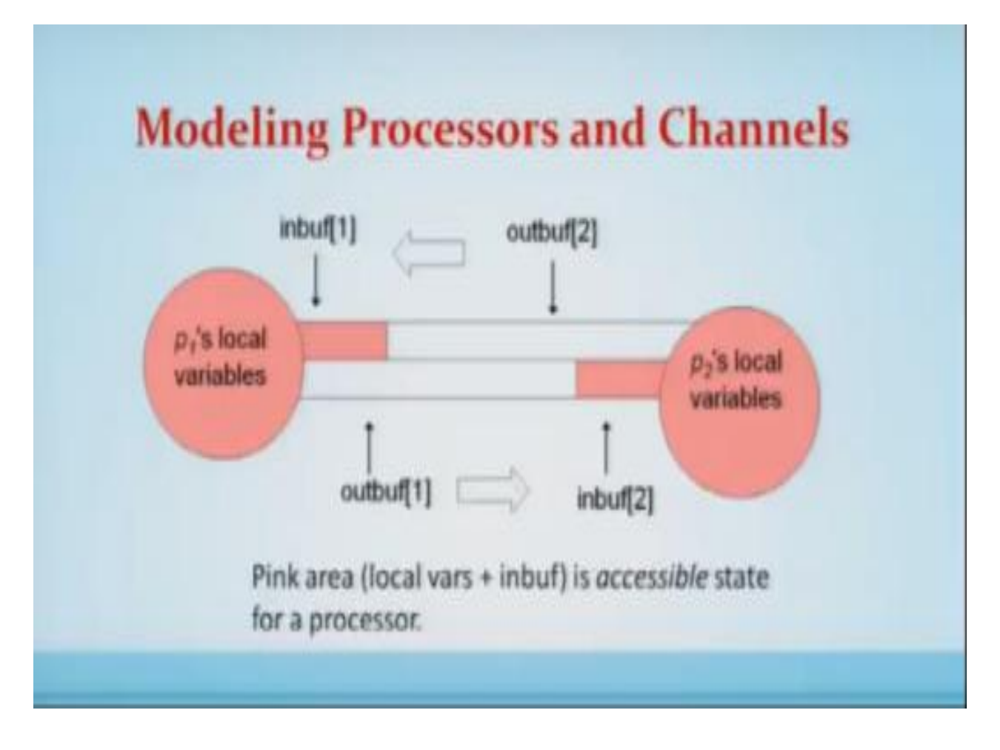
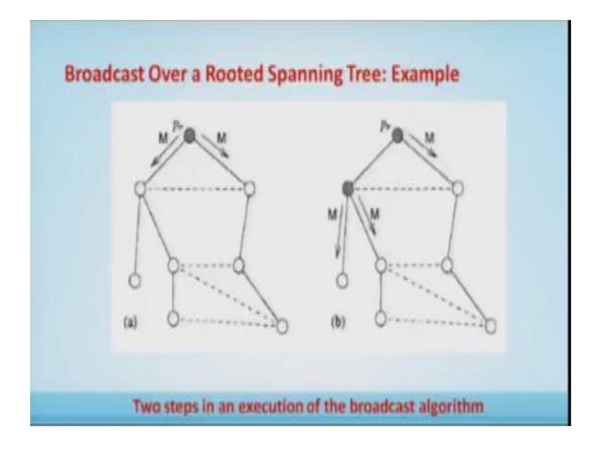
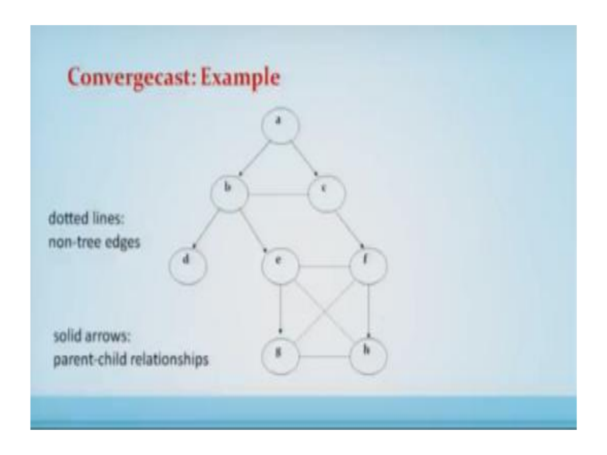
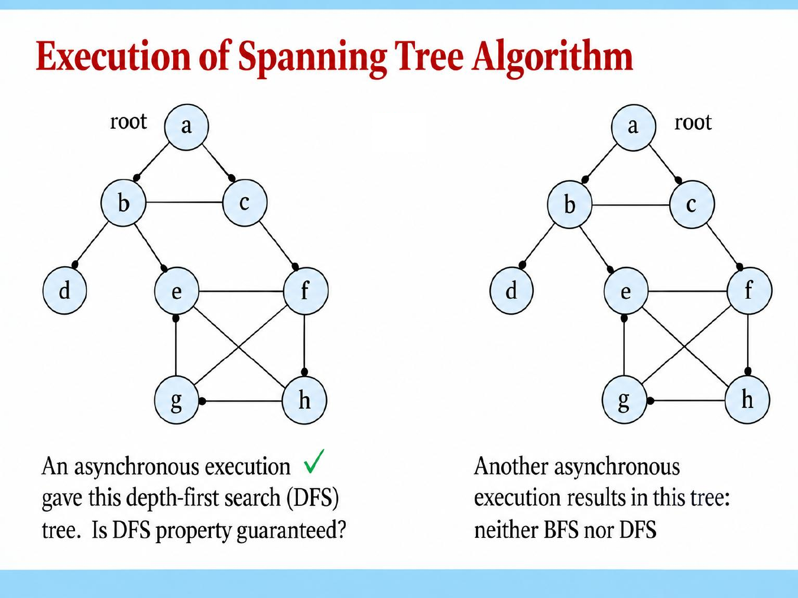
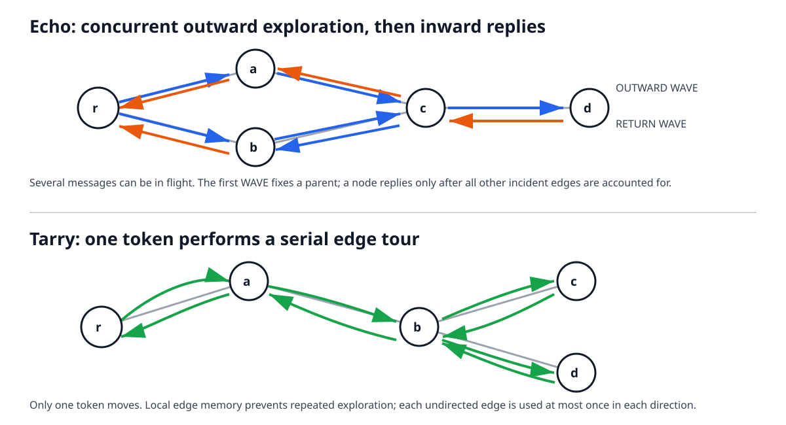
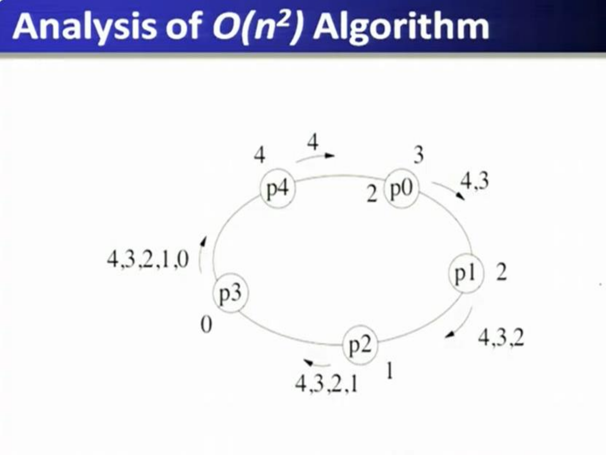
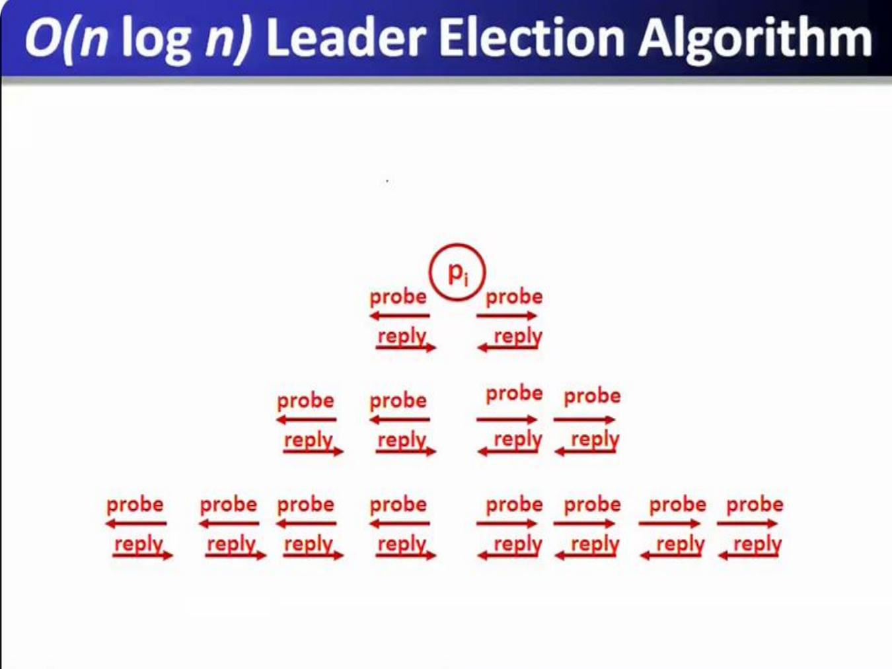
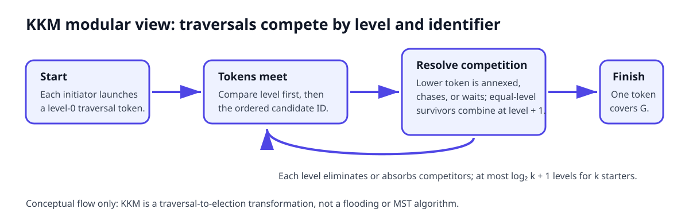
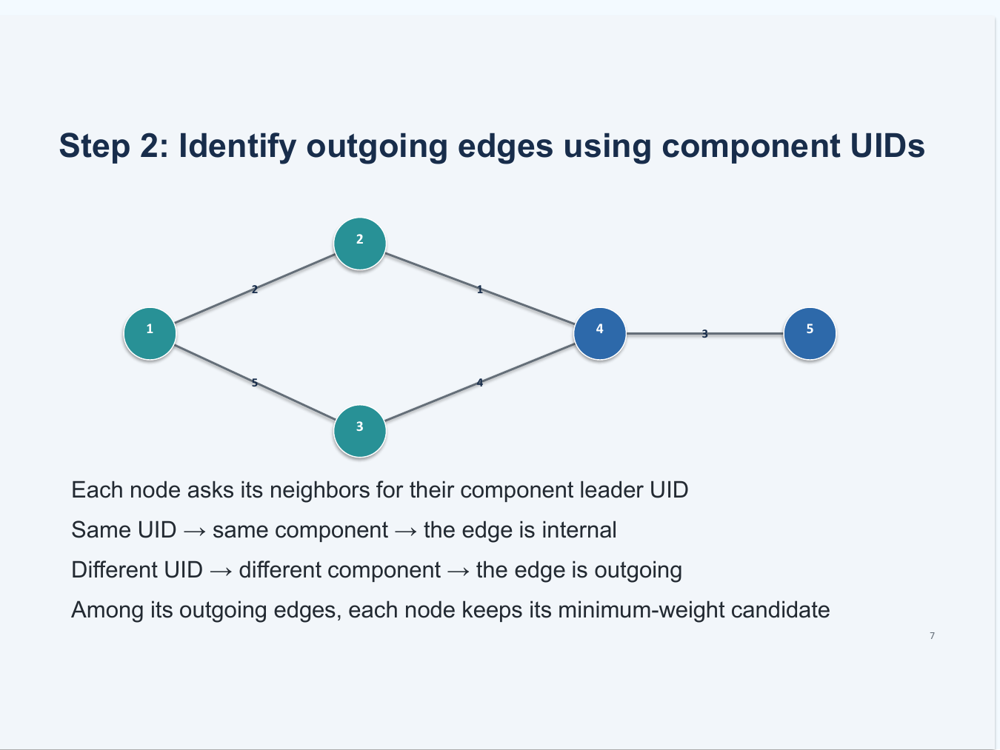
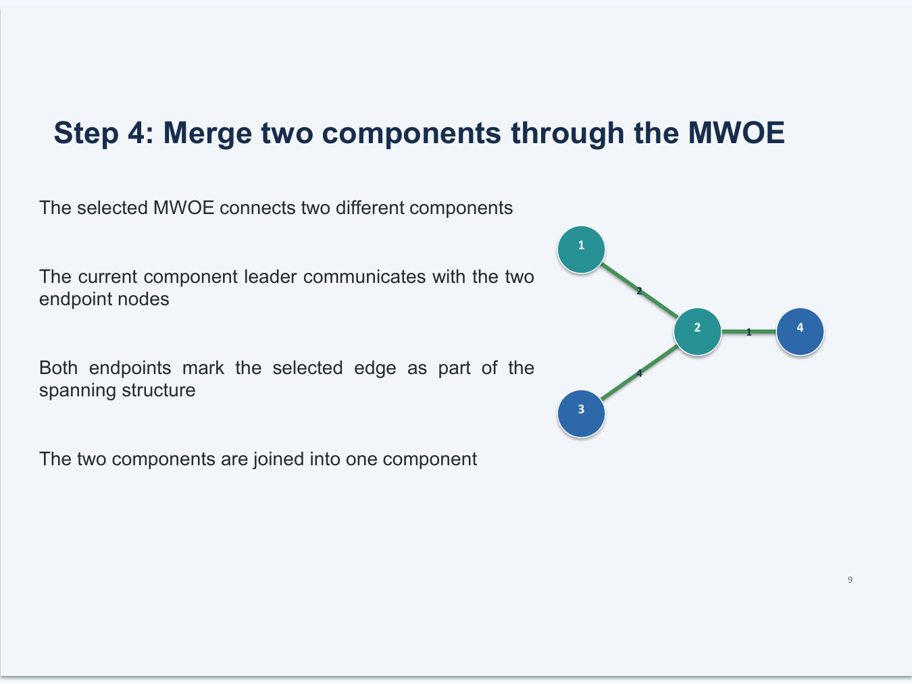

# Wave, traversal, leader election, and spanning trees

## 1. Message-passing executions

The network is a graph $G=(V,E)$ with $n=|V|$ processes and $m=|E|$ communication links. A process can inspect only its local state and received messages; it cannot directly read another process's memory.

A **configuration** is a snapshot of the entire distributed system at one instant:

$$C=(\text{local state and input buffer of each }P_i,\ \text{contents of every channel}).$$

- **Process state:** variables, program position, protocol data such as `parent` or `leaderID`, and messages waiting in the input buffer.
- **Channel state:** messages sent but not yet delivered.

The global configuration is a mathematical model; no process can inspect it directly.

An execution is a sequence $C_0\rightarrow C_1\rightarrow C_2\rightarrow\cdots$ created by events:

- A **delivery event** removes one in-transit message from a channel and places it in the receiver's input buffer.
- A **computation event** schedules one process. Using only its local state and buffered messages, it updates its variables and may append new messages to outgoing channels.

Example: if $P_1$ sends `ELECTION(7)` to $P_2$, the state transitions are

$$C_0\xrightarrow{\text{$P_1$ computes/sends}}C_1
\xrightarrow{\text{deliver to $P_2$}}C_2
\xrightarrow{\text{$P_2$ computes}}C_3.$$

In $C_1$ the message is still in the channel; in $C_2$ it is waiting in $P_2$'s input buffer; only in the final step does $P_2$ read it, update its state, and perhaps forward another message. Delivery and processing are therefore separate events in the asynchronous model.



In a synchronous execution, computation and message delay have known bounds, so algorithms can be analysed in rounds. A fair asynchronous execution normally assumes that every correct process keeps taking steps and every sent message is eventually delivered, but gives no finite delivery deadline. Fairness therefore supports eventual termination; it does **not** make a timeout proof of failure.

## 2. Rooted-tree communication primitives

A rooted spanning tree contains all $n$ processes, has $n-1$ edges, and gives every non-root process one parent.

### Broadcast and convergecast

In a **broadcast**, the root sends a value to its children and each non-root forwards it to its children. It uses $n-1$ messages and has causal depth equal to the tree height $h$.

```text
Algorithm 1: Spanning tree broadcast algorithm.

Initially (M) is in transit from p_r to all its children in the spanning tree.

Code for p_r:
1:  upon receiving no message:          // first computation event by p_r
2:      terminate

Code for p_i, 0 <= i <= n - 1, i != r:
3:  upon receiving (M) from parent:
4:      send (M) to all children
5:      terminate
```

Each non-root receives exactly once through its parent edge. Every tree edge carries one message, giving $n-1$ messages.



In a **convergecast**, leaves send toward the root. An internal process waits for all children, combines their values, and sends one result to its parent. It also uses $n-1$ messages and has causal depth $h$.

```text
leaves send messages to their parents

non-leaves wait to get message from each child,
then send combined (aggregate) info to parent
```

The root receives the final aggregate. Every non-root sends exactly once, giving $n-1$ messages.



Together, broadcast followed by convergecast is a tree wave with $2(n-1)$ messages and causal depth $2h$. Without a message-delay bound, its asynchronous wall-clock time is unbounded.

### Constructing a rooted tree

```text
Algorithm 2: Modified flooding algorithm to construct a spanning tree.
Code for processor p_i, 0 <= i <= n - 1.

Initially parent = ⊥, children = ∅, and other = ∅.

1:  upon receiving no message:
2:      if p_i = p_0 and parent = ⊥ then            // root has not yet sent (M)
3:          send (M) to all neighbors
4:          parent := p_0

5:  upon receiving (M) from neighbor p_j:
6:      if parent = ⊥ then                          // p_i has not received (M) before
7:          parent := p_j
8:          send (parent) to p_j
9:          send (M) to all neighbors except p_j
10:     else send (already) to p_j

11: upon receiving (parent) from neighbor p_j:
12:     add p_j to children
13:     if children ∪ other contains all neighbors except parent then
14:         terminate

15: upon receiving (already) from neighbor p_j:
16:     add p_j to other
17:     if children ∪ other contains all neighbors except parent then
18:         terminate
```

With equal one-edge-per-round propagation, the first arrival follows a shortest-hop path and the result is a BFS tree. In an asynchronous execution, a longer path may arrive first, so the tree need not be BFS or DFS.



## 3. Wave and traversal algorithms

### Wave algorithm

A **wave** is a finite distributed computation with at least one decision event such that every process participates and causally influences that decision. It has two conceptual directions:

1. information diffuses through the network;
2. evidence that the diffusion is complete returns to the decision process.

Broadcast alone is not a complete wave: the initiator does not know that every process has participated. An echo/convergecast supplies the missing completion evidence.

### Echo on an arbitrary graph

Assumptions: one initiator, a connected undirected graph, reliable links, and no crashes during the wave.

```text
initiator sends WAVE on every incident edge

on first WAVE at v from p:
    parent[v] := p
    send WAVE on every other incident edge

record every later WAVE as that edge's response

after a WAVE has arrived on every non-parent edge:
    send WAVE back to parent[v]

initiator decides after every incident edge has replied
```

The first `WAVE` received by each non-initiator selects its parent, so echo simultaneously constructs the rooted spanning tree described above. Parent pointers cannot form a cycle because each points toward an earlier first-reception event.

On a non-tree edge, the two crossing `WAVE` messages account for each other. On a tree edge, the later message is the returning echo. A node replies to its parent only after every other edge is accounted for; therefore the initiator's final decision means that the entire connected graph participated.

Each undirected edge carries at most one message in each direction, so the standard echo wave costs at most $2m$ messages. This is a message bound, not a finite asynchronous time bound.

### Tarry's traversal algorithm

Echo explores many branches concurrently. **Tarry traversal** moves exactly one token, so process visits are serialized.

Each process records the edge by which the token first entered and which incident edges have already been used. It forwards the token on an unused edge; a non-initiator uses its entry edge for the return only after its other usable edges are exhausted. The initiator terminates when the token returns and no unused incident edge remains.

Two invariants give correctness:

- the token never crosses the same edge twice in the same direction;
- if an incident edge remains unused, the token cannot permanently finish at that process.

Thus every reachable node is visited, the token returns to the initiator, and each undirected edge is traversed at most once in each direction: at most $2m$ token messages. Tarry is not automatically DFS; a particular local edge-choice rule can make the tour DFS-like.



| Primitive | Communication pattern | Completion known where? | Messages |
|---|---|---|---:|
| Tree broadcast | Root to children | Not at the root by itself | $n-1$ |
| Tree convergecast | Children to root | At the root | $n-1$ |
| Echo wave | Concurrent exploration, then replies | At the initiator | at most $2m$ |
| Tarry traversal | One serial token | At the initiator | at most $2m$ |

## 4. Leader-election specification

Leader election requires:

- **Validity:** the winner is an eligible member, such as the highest live ID.
- **Uniqueness/safety:** at most one winner is elected for an election epoch.
- **Agreement:** all correct processes output the same winner.
- **Termination/liveness:** every correct process eventually outputs a winner.

A deterministic algorithm cannot elect a leader in a perfectly symmetric anonymous ring: identical processes receive indistinguishable histories and make identical decisions. Unique IDs, randomness, a distinguished process, or sufficient topological asymmetry can break symmetry.

Useful ring terms:

- **oriented:** processes agree on clockwise/counter-clockwise;
- **anonymous:** processes have no unique IDs;
- **uniform:** the code does not depend on knowing $n$;
- **unidirectional/bidirectional:** messages use one/both ring directions.

Fault-free election is possible in an asynchronous network with reliable eventual delivery. The impossibility arises when termination must be guaranteed despite crashes: silence cannot distinguish a crashed node from an arbitrarily slow node. Timeout-based recovery therefore needs eventual timing assumptions or a failure detector.

## 5. Synchronous complete-graph election 

For a complete graph $K_n$ with unique IDs, every process sends its ID to all other processes in round 1. At the end of that round, every process has the same set of IDs and independently selects the maximum.

For $K_5$:

- directed sends in round 1: $5(5-1)=20$;
- information rounds: **1**;
- winner: the process with the maximum ID.

An optional `LEADER` broadcast adds 4 sends and a second round. It is redundant when every process already computed the maximum.

## 6. Ring election

### LCR on a unidirectional ring

Assumptions: reliable oriented unidirectional ring, unique comparable IDs, no crashes, and every process initially participates.

```text
send value of own id to the left

when receive an id j (from the right):
    if j > id then
        forward j to the left (this processor has lost)
    if j = id then
        elect self (this processor has won)
    if j < id then
        do nothing
```

**Correctness.** The maximum ID can never meet a larger ID, so every process forwards it and it returns to its owner. Every smaller ID meets a larger ID before completing the ring and is discarded. Hence exactly the maximum declares; the subsequent announcement gives agreement.

The election traffic is $\Theta(n^2)$ in the worst ordering; notification adds $n$ messages. Under this counting convention, the decreasing-ID arrangement gives

$$n+\sum_{i=0}^{n-1}(i+1)=n+\frac{n(n+1)}2$$

transmissions including the final notification. Causal distance to declaration is $O(n)$, but asynchronous elapsed time is not finitely bounded.



### Hirschberg-Sinclair on a bidirectional ring

Assumptions: reliable bidirectional ring, unique comparable IDs, no crashes, and initially unknown ring size.

```text
Algorithm 5: Asynchronous leader election: code for processor p_i, 0 <= i < n.

Initially, asleep = true

1:  upon receiving no message:
2:      if asleep then
3:          asleep := false
4:          send <probe, id, 0, 1> to left and right

5:  upon receiving <probe, j, k, d> from left (resp., right):
6:      if j = id then terminate as the leader
7:      if j > id and d < 2^k then                  // forward the message
8:          send <probe, j, k, d + 1> to right (resp., left)
                                                    // increment hop counter
9:      if j > id and d >= 2^k then                 // reply to the message
10:         send <reply, j, k> to left (resp., right)
                                                    // if j < id, message is swallowed

11: upon receiving <reply, j, k> from left (resp., right):
12:     if j != id then send <reply, j, k> to right (resp., left)
                                                    // forward the reply
13:     else                                         // reply is for own probe
14:         if already received <reply, j, k> from right (resp., left) then
15:             send <probe, id, k + 1, 1>           // phase k winner
```

In phase $k=0,1,2,\ldots$, an active candidate probes distance $2^k$ in both directions. A larger ID suppresses a smaller probe. A probe reaching its radius returns; a candidate receiving both replies survives to the next phase. If its probes meet after covering the ring, it is the maximum and wins.



Survivors in phase $k$ are separated by distance at least $2^{k-1}$, so there are only $O(n/2^k)$ of them. Each generates $O(2^k)$ probe/reply traffic; therefore each phase costs $O(n)$ and the $O(\log n)$ phases cost

$$O(n\log n) \text{ messages}.$$

The matching $\Omega(n\log n)$ lower bound is for the relevant comparison-based election model on asynchronous rings of unknown size. It is not an unconditional bound for every stronger model; synchrony and non-comparison operations can change what is achievable.

## 7. Failure-triggered election

### Failure-triggered ring protocol

Unlike LCR, this protocol starts after a coordinator is suspected. One or more processes circulate `ELECTION(id, attribute)` clockwise. A larger candidate replaces a smaller candidate; an ID that returns to its owner wins and circulates `ELECTED(id)`.

Under this protocol's convention:

- eventual leader starts: $2n$ messages (one election circulation and one announcement);
- worst initiator position: $3n-1$ messages.

For $n=10$, the worst case is $3(10)-1=29$ messages under this protocol. LCR uses a different count and normally starts with every process participating.

With concurrent initiators, a process caches the highest candidate seen and suppresses lower runs. “Fair” here does not mean equal probability of leadership—the highest eligible ID still wins. It means reliable/fair circulation does not permanently starve a live candidacy, and the result does not depend on which live process first noticed the failure.

If the highest-ID process fails mid-election, no algorithm can infer that from silence alone in pure asynchrony. With eventual synchrony, another process times out, starts a new epoch/run, and the highest remaining live ID eventually wins. Missing a real failure mainly blocks liveness; false suspicion can cause repeated elections and, without epochs or quorum protection, competing coordinators. A network partition is not automatically handled safely by this ring protocol.

### Bully algorithm

Assumptions: known membership, totally ordered IDs, crash-stop failures, and eventually accurate timeouts.

1. A suspecting process sends `ELECTION` to every higher-ID live candidate it knows.
2. A higher process replies `OK` and starts/continues its own election.
3. A process receiving no higher reply declares and sends `COORDINATOR` to lower IDs.
4. A process that received `OK` but no coordinator announcement eventually times out and retries.

The highest live ID eventually wins after failures and timing stabilize. When the lowest ID starts and every higher process successively competes, the number of `ELECTION` sends alone is

$$ (n-1)+(n-2)+\cdots+1=\frac{n(n-1)}2,$$

so total traffic is $O(n^2)$. A five-transmission failure chain is one execution, not a universal Bully time bound.

## 8. Election in arbitrary networks

### With an existing rooted tree

Convergecast the maximum ID to the root, then broadcast the winner. Cost: $2(n-1)$ messages. This assumes a distinguished root and is not election from scratch.

### Korach-Kutten-Moran (KKM): modular traversal-to-election transformation

Model: a connected asynchronous network with reliable bidirectional links, distinct ordered process IDs, and $k$ possible starters; FIFO channels are not required. Assume a serial traversal algorithm costs at most $f(n)$ messages.

Each starter launches a traversal token labelled by its candidate and a **level**. Competing tokens compare level and then candidate ID. A weaker traversal may be annexed, chase a stronger traversal, or wait so that conflicting traversals cannot both finish independently. When same-level competition is resolved, the surviving combined territory advances to the next level; lower-level contenders lose to the stronger level. A traversal that completes the whole network without an undefeated competitor elects its initiator.

The safety idea is that the comparison/absorption rules leave at most one traversal able to complete as winner. The liveness idea is that competition strictly eliminates candidates or raises a level; with $k$ starters there are at most $\log_2 k+1$ levels. The transformation's message bound is

$$\bigl(f(n)+n\bigr)\bigl(\log_2 k+1\bigr),$$

where $f(n)$ is the traversal's message bound and $k$ is the number of starters. A topology-sensitive form uses $f(m)$.



- KKM transforms a traversal algorithm into leader election.
- Max-ID flooding directly propagates candidate IDs.
- GHS constructs a minimum spanning tree.

## 9. Distributed minimum spanning tree

Assumptions: a connected undirected weighted graph, reliable communication, and distinct edge weights or deterministic tie-breaking. A minimum spanning tree (MST) connects all nodes with minimum total edge weight.

The algorithm uses a **GHS-style** fragment construction:

1. every node starts as a one-node level-0 fragment;
2. a fragment leader broadcasts a search;
3. nodes test incident edges and reject internal edges;
4. candidates convergecast so the leader obtains the fragment's minimum-weight outgoing edge (MWOE);
5. fragments merge across the MWOE and broadcast the new fragment identity;
6. repeat until the connected graph has one fragment.



The cut property makes the choice safe: an MWOE crossing a fragment's cut belongs to some MST. Equal-level fragments merge into a fragment one level higher; a lower-level fragment can be absorbed by a higher-level fragment. A level-$L$ fragment contains at least $2^L$ nodes, so there are $O(\log n)$ levels.



In the lecture variant, the larger endpoint UID becomes the merged-fragment leader. Bounds:

- time: $O(n\log n)$;
- communication: $O((n+m)\log n)$.

Classical GHS message complexity is $O(m+n\log n)$. The lecture analysis uses $O((n+m)\log n)$; another equivalent-style presentation may separate edge testing as $O(n\log n+m)$.

After the tree exists, a unique tree leader can be chosen with max-ID convergecast plus broadcast in $2(n-1)$ messages. This final election is separate from constructing the MST.

## 10. Luby's maximal independent set 

An **independent set** contains no adjacent vertices. It is **maximal** if no additional vertex can be added without breaking independence. Maximal does not mean maximum-cardinality.

Luby's randomized synchronous algorithm maintains active vertices. In each phase:

1. every active vertex chooses a fresh random priority (break ties by unique ID);
2. an active vertex whose priority exceeds every active neighbour joins the MIS;
3. selected vertices and all their neighbours become inactive;
4. the remaining active graph repeats.

Selected neighbours cannot coexist because each would need a greater priority than the other, proving independence. Every non-selected vertex removed in step 3 is adjacent to a selected vertex; when no active vertices remain, the result is maximal. The standard algorithm terminates in $O(\log n)$ phases with high probability (and has the corresponding expected logarithmic behaviour); each phase exchanges priorities/status over active edges.

Topology behaviour depends on the random priorities:

| Graph | Possible/final MIS behaviour |
|---|---|
| Complete graph $K_n$ | The unique global priority maximum joins in phase 1; any singleton is maximal. |
| Star | If the centre beats every leaf, the centre alone wins. If a leaf beats the centre, winning leaves remove the centre and eventually all leaves form the MIS. |
| Ring | Non-adjacent local maxima join, their neighbours leave, and gaps repeat. Many MISs are possible; an alternating set is only one example. |

A deterministic trace requires the random priorities for every phase.

## 11. Consensus and system examples

Election chooses a process; consensus chooses a value. They are related but not identical.

In Paxos, proposers use unique proposal numbers; acceptors durably record promises and accepted values; learners discover a value accepted by a majority. A proposer that receives promises from a majority must adopt the value from the highest-numbered previously accepted proposal, if one exists. Any two majorities intersect, so two different values cannot both be chosen. Paxos safety is asynchronous, while progress needs a reachable majority and eventual communication/stable proposing behaviour.

In Chubby, a majority elects one master, with one vote per replica per run. In the simplified ZooKeeper-style example, increasing sequence IDs are assigned, the highest is chosen, and each process monitors the next-higher participant. ZooKeeper's production Fast Leader Election/Zab protocol is different.

## 12. Election comparison

| Algorithm | Topology/model | Initiators | Failure support | Election messages |
|---|---|---|---|---:|
| $K_n$ all-to-all | synchronous complete graph | all | none | $n(n-1)$ |
| LCR | async unidirectional ring | all | none | $\Theta(n^2)$ worst case |
| Hirschberg-Sinclair | async bidirectional ring | all | none | $O(n\log n)$ |
| Failure-triggered ring | oriented ring + eventual detection | one or more | coordinator crash, after stabilization | $2n$ to $3n-1$ |
| Bully | known complete membership + usable timeouts | one or more | crash-stop, after stabilization | $O(n^2)$ worst case |
| Rooted-tree max | existing rooted tree | root coordinates | none | $2(n-1)$ including announcement |
| KKM | async arbitrary connected graph | $k$ | no crash in base model | $(f(n)+n)(\log_2 k+1)$ |

## Sources

- [Classical leader-election algorithms](../sources/04_Classical-Leader-Election-Algorithms.pdf)
- [Distributed leader-election protocols](../sources/05_Distributed-Leader-Election-Protocols.pdf)
- [Message-passing algorithms](../sources/06_Message-Passing-Algorithms.pdf)
- [Distributed spanning tree](../sources/07_Distributed-Spanning-Tree.pdf)
- [Korach, Kutten, and Moran, “A Modular Technique for the Design of Efficient Distributed Leader Finding Algorithms”](https://doi.org/10.1145/323596.323611)
- [Luby, “A Simple Parallel Algorithm for the Maximal Independent Set Problem”](https://www.cs.cmu.edu/~guyb/paralg/papers/Luby86.pdf)
