# Association Rule Mining

Source: `Akash Notes Folder`.

> [!abstract] How to use this note
> Follow the lecture order: market basket model -> support/confidence -> frequent itemsets -> Apriori -> FP-growth -> rule generation -> interestingness. For every algorithm, learn the input, the repeated step, the pruning principle, and what to write in a numerical answer.

## 1. Market basket analysis

Market basket analysis studies a supermarket-like transaction database to discover products that occur together. Association-rule mining was proposed by Agrawal *et al.* in 1993 and is used for information-driven marketing, catalog design, store layout, cross-selling, and customer segmentation.

Example: if `{bread, salami}` appears in three baskets and `{bread, salami, ham}` in two, the rule `{bread, salami} -> {ham}` has confidence $2/3$.

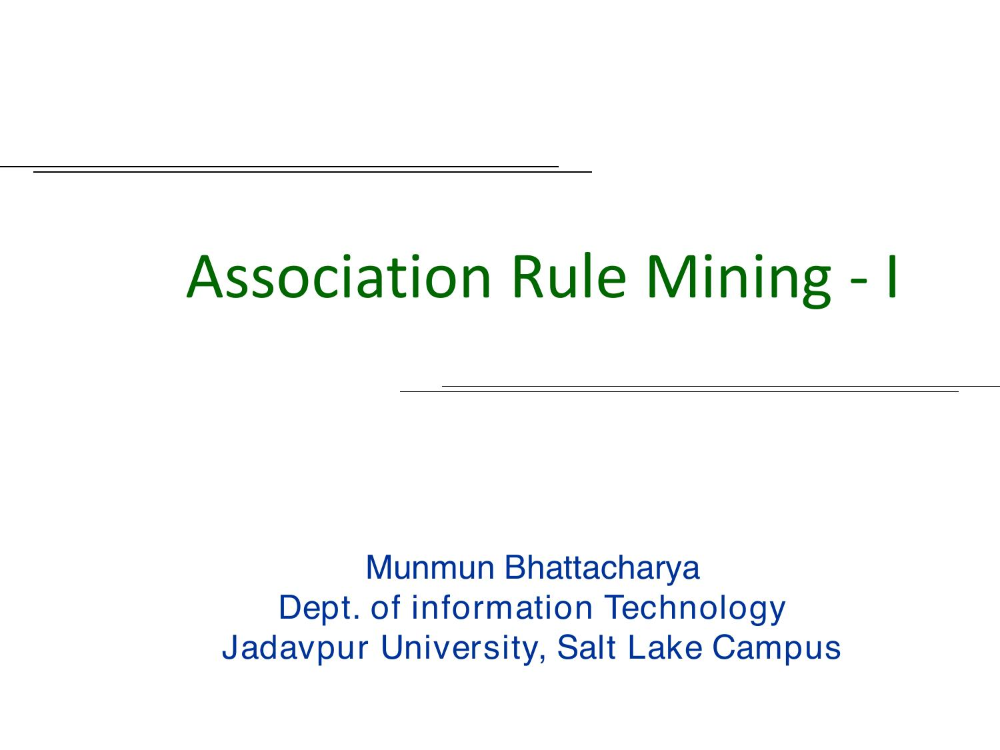

> [!example] Plain meaning
> A rule does not claim that buying bread *causes* buying ham. It says the two occurred together frequently enough in the recorded transactions to be a useful recommendation or placement candidate.

## 2. The market-basket model

- $I=\{i_1,\dots,i_n\}$: a large set of binary **items**.
- A **transaction** $T$ is a small subset of $I$, e.g. one customer's bill.
- $D=\{T_1,\dots,T_N\}$: the transaction database.
- An **itemset** $X$ is any subset of $I$.

The model deliberately ignores some real-world details, such as quantity purchased and price paid. The lecture assumes categorical item data; numeric data usually needs preprocessing/discretization first.

## 3. Support, confidence, and the mining task

For itemset $X$:

$$\sigma(X)=\#\{T\in D:X\subseteq T\},\qquad supp(X)=\frac{\sigma(X)}{|D|}.$$

An association rule has the form $X\to Y$, where $X\cap Y=\varnothing$.

$$supp(X\to Y)=supp(X\cup Y),\qquad conf(X\to Y)=\frac{\sigma(X\cup Y)}{\sigma(X)}.$$

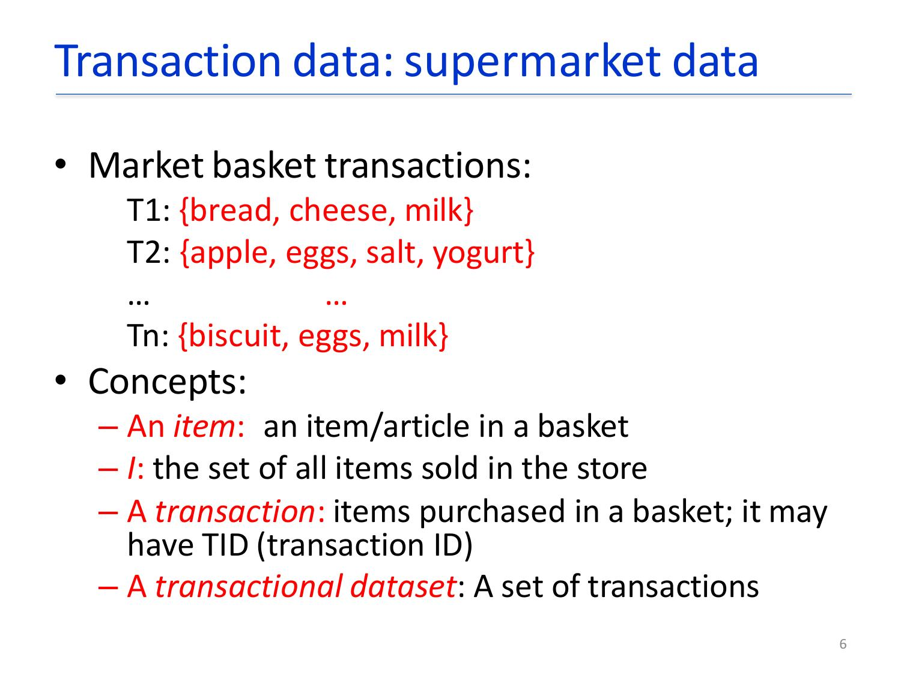

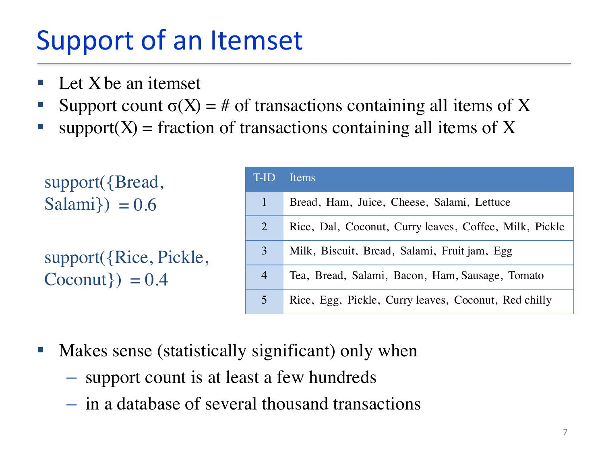

**Support** measures how common the combined itemset is in the whole database. **Confidence** measures the fraction of transactions containing $X$ that also contain $Y$.

For a result to be statistically meaningful, the lecture cautions that its support count should normally be at least a few hundred in a database of several thousand transactions.

Given $I$, $D$, `minsup`, and `minconf`, the task is to find all rules whose support is at least `minsup` and confidence is at least `minconf`. Such rules are called **strong association rules**.

> [!question] PYQ - 2026, CO3(a)-(b)
> **(a) Write a short note on market basket analysis. (b) How to compute confidence for an association rule $X\to Y$?**

> [!success] Answer
> Market basket analysis treats one bill/customer visit as a transaction and each product as an item. It finds frequently co-purchased items and rules such as `{bread, salami} -> {ham}`. Uses include recommendation, cross-selling, promotion, catalog design, store layout, and customer segmentation.
>
> To compute confidence, count transactions containing both $X$ and $Y$ and divide by transactions containing $X$:
>
> $$conf(X\to Y)=\frac{\#(X\cup Y)}{\#(X)}.$$
>
> If 30 baskets contain bread and 18 contain both bread and butter, $conf(\{bread\}\to\{butter\})=18/30=60\%$.

## 4. Frequent itemsets and anti-monotonicity

An itemset is **frequent** when its support meets `minsup`. If $X\subseteq Y$, every transaction containing $Y$ contains $X$, therefore:

$$supp(X)\ge supp(Y).$$

This is the **anti-monotone**, **downward-closure**, or **Apriori** property:

- every subset of a frequent itemset is frequent;
- every superset of an infrequent itemset is infrequent and can be discarded without counting it.

Without this property, $n$ items create $2^n$ possible itemsets, which is computationally impractical.

Association-rule mining therefore has two phases: first find frequent itemsets $Z$; then enumerate each nonempty binary partition $Z=X\cup Y$ as $X\to Y$. All rules from one itemset have the same support $supp(Z)$, but not necessarily the same confidence.

> [!question] PYQ - 2025, CO3(a)
> **Explain in detail about association-rules mining task. Define confidence of an association rule. Discuss about the anti-monotone property of support.**

> [!success] Answer
> Association-rule mining takes item set $I$, transaction database $D$, `minsup`, and `minconf`; it returns every $X\to Y$ where $X\cap Y=\varnothing$, $supp(X\cup Y)\ge minsup$, and $conf(X\to Y)\ge minconf$.
>
> Confidence is $conf(X\to Y)=supp(X\cup Y)/supp(X)=\sigma(X\cup Y)/\sigma(X)$.
>
> For $X\subseteq Y$, $supp(X)\ge supp(Y)$. Hence every subset of a frequent itemset is frequent; equivalently, if an itemset is infrequent, every superset is infrequent. Apriori uses this to prune candidates before expensive database counting.

## 5. Apriori algorithm

Let $L_k$ be frequent itemsets of size $k$ and $C_k$ candidate itemsets of size $k$.

```text
L1 = frequent 1-itemsets
for k = 2 while L(k-1) is not empty:
    Ck = join(L(k-1), L(k-1))
    prune c if any (k-1)-subset of c is not in L(k-1)
    scan D and count every candidate c contained in transaction T
    Lk = {c in Ck | count(c) >= minsup count}
return union of all Lk
```

### Join and prune

Join sorted $(k-1)$-itemsets that agree on their first $k-2$ items. `{1,2,3}` and `{1,2,4}` generate `{1,2,3,4}`. Prune it if any 3-subset is absent from $L_3$. This directly applies anti-monotonicity.

To count candidates efficiently, a **hash tree** stores candidate itemsets at leaves. When scanning a transaction, generate its relevant $k$-subsets and traverse hash branches rather than checking every candidate against every transaction.

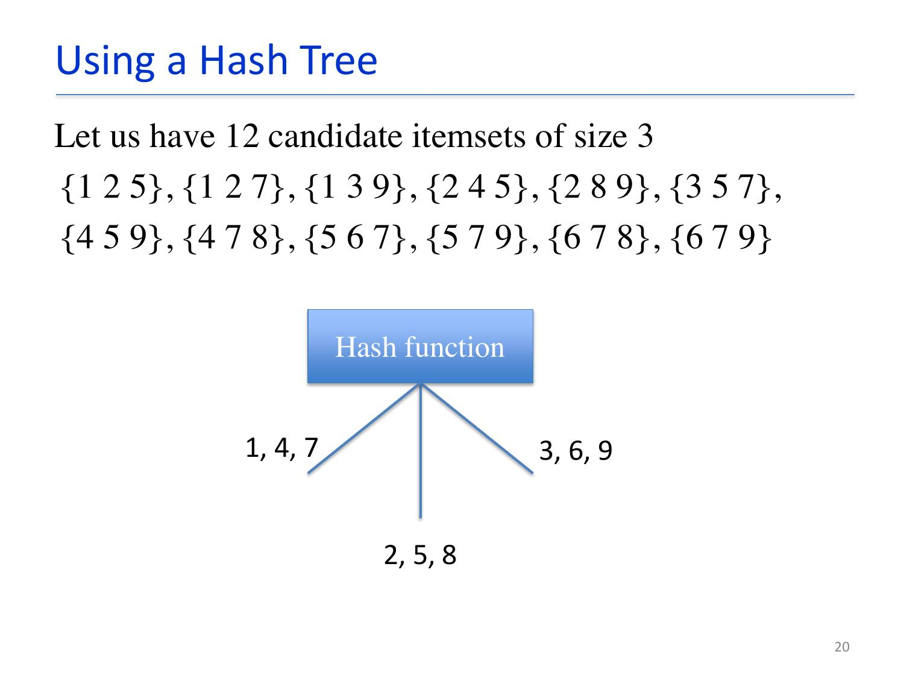

### Limitations

1. A huge number of candidates can be generated.
2. The full database is scanned repeatedly.
3. Pattern matching many candidates to every transaction is costly.

> [!question] PYQ - 2025, CO3(c)
> **Illustrate the Apriori algorithm with a suitable example. Are there any limitations of Apriori algorithm?**

> [!success] Answer
> Let $D=\{\{A,B,C\},\{A,B\},\{A,C\},\{B,C\},\{A,B,C\}\}$ and `minsup count = 2`.
>
> 1. $L_1=\{A:4,B:4,C:4\}$.
> 2. $C_2=\{AB,AC,BC\}$; each has support 3, so $L_2=\{AB:3,AC:3,BC:3\}$.
> 3. $C_3=\{ABC\}$; all its 2-subsets are frequent, so it survives pruning. Its support is 2, hence $L_3=\{ABC:2\}$.
> 4. No larger candidate exists. All frequent itemsets are the union of $L_1,L_2,L_3$.
>
> For a rule, $conf(AB\to C)=supp(ABC)/supp(AB)=2/3=66.7\%$. Limitations are massive candidate generation, repeated scans, and expensive candidate matching.

## 6. FP-growth

FP-growth removes Apriori's costly candidate-generation stage.

1. First database scan: count items, discard infrequent items, and order the frequent items by descending support in header list $L$.
2. Second scan: order each filtered transaction according to $L$ and insert it into an **FP-tree**. Shared prefixes share nodes; node counts are incremented.
3. Header-table node links connect all tree nodes carrying the same item.
4. Mine from the least frequent item upward. Its prefix paths form the **conditional pattern base**.
5. Construct its conditional FP-tree and recursively mine it. A single path directly yields all combinations on that path.

For the lecture example with `minsup = 3`, the first scan gives the header list $L=\{(f,4),(c,4),(a,3),(b,3),(m,3),(p,3)\}$. Mining the conditional bases yields the maximal frequent itemsets $\{c,p\}$ and $\{f,c,a,m\}$. FP-growth avoids candidate generation and is typically about an order of magnitude faster than Apriori on this example type.

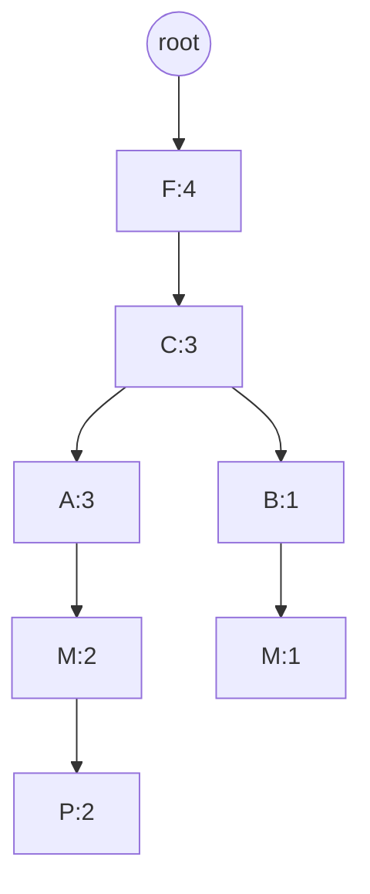

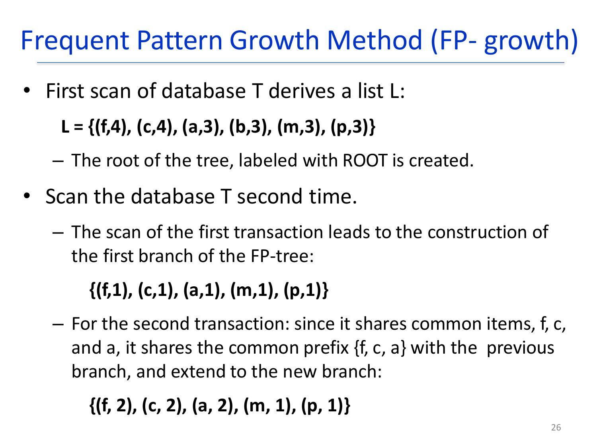

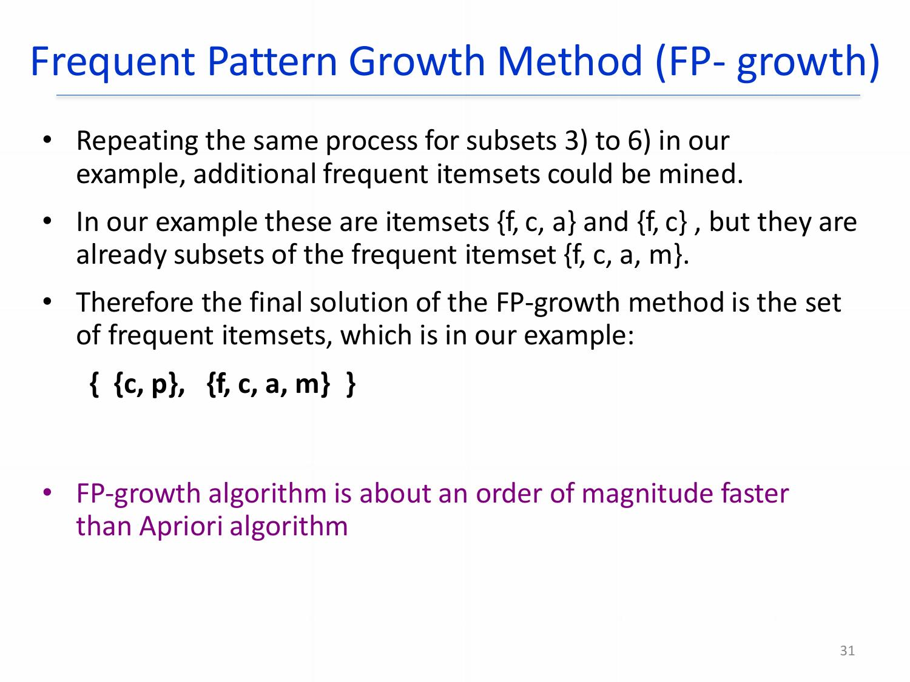

> [!tip] Why the tree helps
> Common transaction prefixes are stored once with counts. Conditional prefix paths let FP-growth examine only the data relevant to a suffix item.

> [!question] PYQ - 2025, CO3(b)
> **Discuss about maximal frequent item set. Explain mining association rules FP-growth algorithm with minimum support threshold of 3.**
>
> $T_1=\{F1,C1,S1,N1,B1\}$, $T_2=\{C1,S1,B1\}$, $T_3=\{C1,F1,N1\}$, $T_4=\{B1,F1\}$, $T_5=\{F1,C1,B1,N1\}$, $T_6=\{C1,F1,N1\}$.

> [!success] Answer
> A **maximal frequent itemset** is frequent and has no frequent immediate superset. It compactly represents frequent itemsets but does not retain support counts of all subsets.
>
> With `minsup = 3`, supports are `F1:5`, `C1:5`, `N1:4`, `B1:4`, `S1:2`; remove `S1` and use header order `F1,C1,N1,B1`.
>
> | Transaction | Filtered, ordered transaction |
> |---|---|
> | $T_1$ | `F1,C1,N1,B1` |
> | $T_2$ | `C1,B1` |
> | $T_3$ | `F1,C1,N1` |
> | $T_4$ | `F1,B1` |
> | $T_5$ | `F1,C1,N1,B1` |
> | $T_6$ | `F1,C1,N1` |
>
> The FP-tree is:
>
> ```text
> root
> ├─ F1:5
> │  ├─ C1:4 -> N1:4 -> B1:2
> │  └─ B1:1
> └─ C1:1 -> B1:1
> ```
>
> Conditional bases: for `N1`, `F1,C1:4`, yielding `{F1,N1}:4`, `{C1,N1}:4`, `{F1,C1,N1}:4`; for `C1`, `F1:4`, yielding `{F1,C1}:4`. The other frequent pairs are `{F1,B1}:3` and `{C1,B1}:3`. Hence maximal frequent itemsets are `{F1,C1,N1}:4`, `{F1,B1}:3`, and `{C1,B1}:3`.

## 7. Apriori versus FP-growth

| Aspect | Apriori | FP-growth |
|---|---|---|
| Candidates | Generates $C_k$ candidates level-wise | No candidate generation |
| Database access | Repeated full scans | Two scans to build FP-tree; recursive conditional mining |
| Main structure | Candidate set/hash tree | FP-tree, header table, node links |
| Strength | Simple to understand/implement | Usually faster for dense/large data |
| Weakness | Candidate explosion and repeated scans | More complex tree/conditional-tree construction |

> [!question] PYQ - 2026, CO3(c)-(d)
> **Find frequent itemsets and strong association rules using Apriori for T100 `{M,O,N,K,E,Y}`, T200 `{D,O,N,K,E,Y}`, T300 `{M,A,K,E}`, T400 `{M,U,C,K,Y}`, T500 `{C,O,K,I,E}`, with support = 30% and confidence = 40%. Compare Apriori and FP-growth algorithms.**

> [!success] Answer
> There are five transactions, so `minsup count = ceil(0.30 × 5) = 2`.
>
> $L_1$: `{K}:5`, `{E}:4`, `{M}:3`, `{O}:3`, `{Y}:3`, `{N}:2`, `{C}:2`; prune `D,A,U,I` (count 1).
>
> $L_2$: `{KE}:4`; `{MK,OK,OE,KY}:3`; `{ME,MY,ON,OY,NK,NE,NY,KC,EY}:2`.
>
> $L_3$: `{MKE}`, `{MKY}`, `{ONK}`, `{ONE}`, `{ONY}`, `{OKE}`, `{OKY}`, `{OEY}`, `{NKE}`, `{NKY}`, `{NEY}`, `{KEY}`, each with support 2.
>
> $L_4$: `{ONKE}`, `{ONKY}`, `{ONEY}`, `{OKEY}`, `{NKEY}`, each support 2. $L_5$: `{ONKEY}:2`.
>
> Examples of strong rules: `M -> K = 3/3 = 100%`, `E -> K = 4/4 = 100%`, `K -> E = 4/5 = 80%`, `O -> E = 3/3 = 100%`, `N -> O = 2/2 = 100%`, `C -> K = 2/2 = 100%`, `MK -> E = 2/3 = 66.7%`, and `ON -> KEY = 2/2 = 100%`. Retain every rule whose calculated confidence is at least 40%.
>
> Apriori uses join-prune and repeated scans; FP-growth uses a compressed prefix tree and conditional pattern bases, avoids candidates, and is normally faster on dense/large transaction data.

## 8. Rule generation from frequent itemsets

From a frequent $k$-itemset $Z$, every nonempty proper subset $X$ gives rule $X\to Z-X$: $2^k-2$ nontrivial rules. They all share $supp(Z)$ but have different confidences.

If $X'\subset X\subset Y$:

$$conf(X\to Y-X)=\frac{\sigma(Y)}{\sigma(X)}\ge\frac{\sigma(Y)}{\sigma(X')}=conf(X'\to Y-X').$$

Therefore if a rule fails minimum confidence, rule candidates with a **larger consequent** below it in the level-wise rule-generation tree can be pruned.

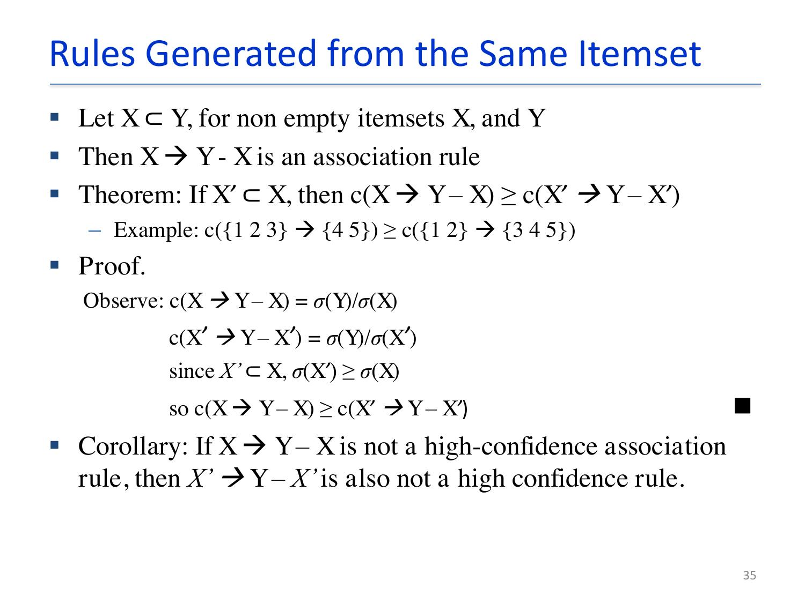

## 9. Maximal and closed frequent itemsets

- **Maximal frequent:** no frequent immediate superset. It is a compact representation, but loses subset support information.
- **Closed:** no immediate superset has exactly the same support count.
- **Closed frequent:** both closed and frequent; it retains enough information to determine support of non-closed frequent sets.

Relationship: `maximal frequent ⊆ closed frequent ⊆ frequent`.

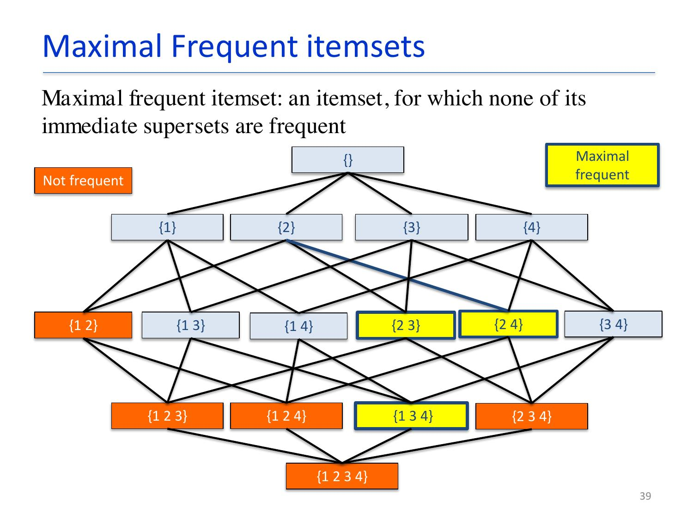

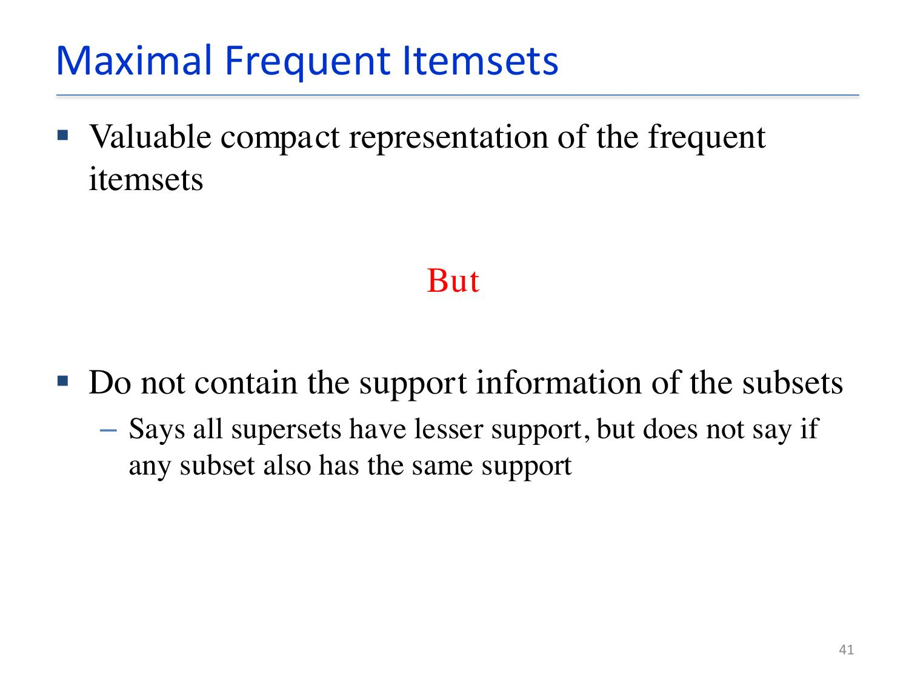

## 10. Evaluating association rules

Relaxing support/confidence can create enormous numbers of rules, so interestingness matters.

- **Objective measures:** statistics derived from data - support, confidence, correlation, and lift.
- **Subjective measures:** novelty, usefulness, actionability, visual inspection, templates, and filtering obvious rules.

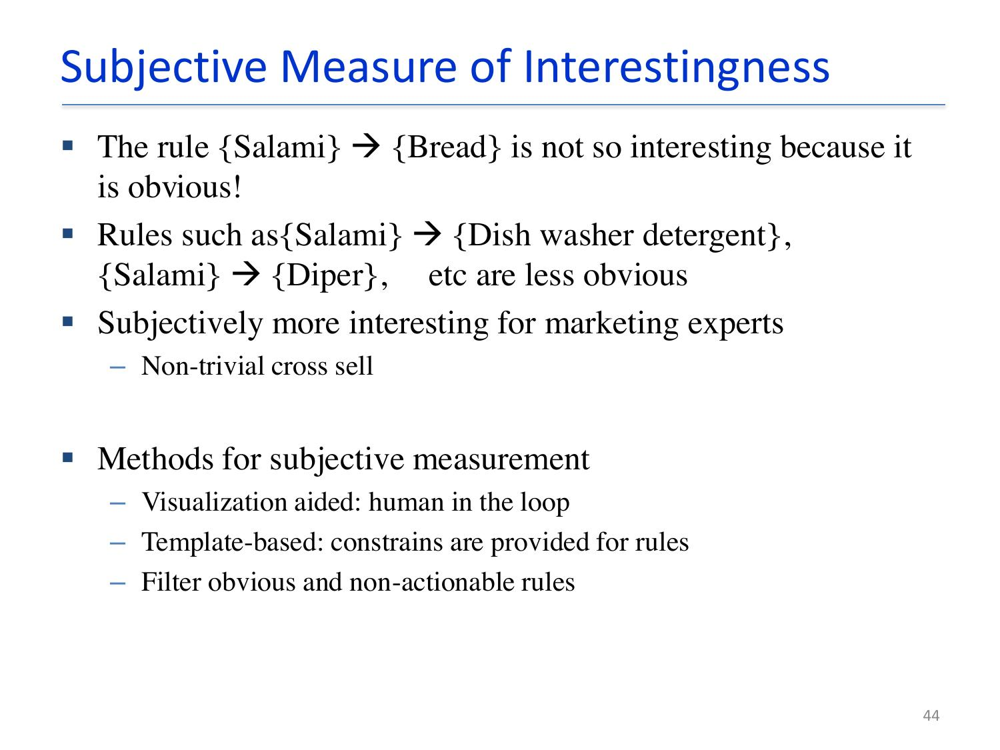

### Why confidence alone can mislead

For rule $X\to Y$:

$$lift(X\to Y)=\frac{conf(X\to Y)}{supp(Y)}=\frac{supp(X\cup Y)}{supp(X)supp(Y)}.$$

- `lift = 1`: independent;
- `lift > 1`: positive correlation;
- `lift < 1`: negative correlation.

If 80% of everyone drinks coffee but only 75% of tea drinkers drink coffee, `Tea -> Coffee` has apparently high confidence (75%) but lift below 1: tea actually lowers the baseline coffee probability. A strong rule is not automatically an interesting rule.

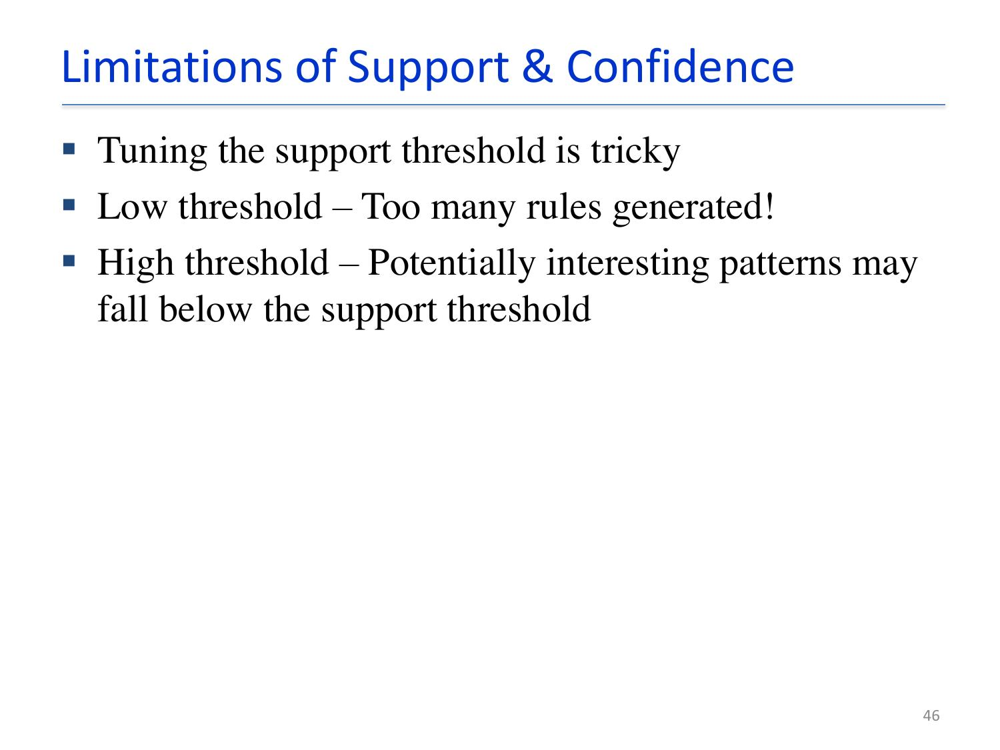

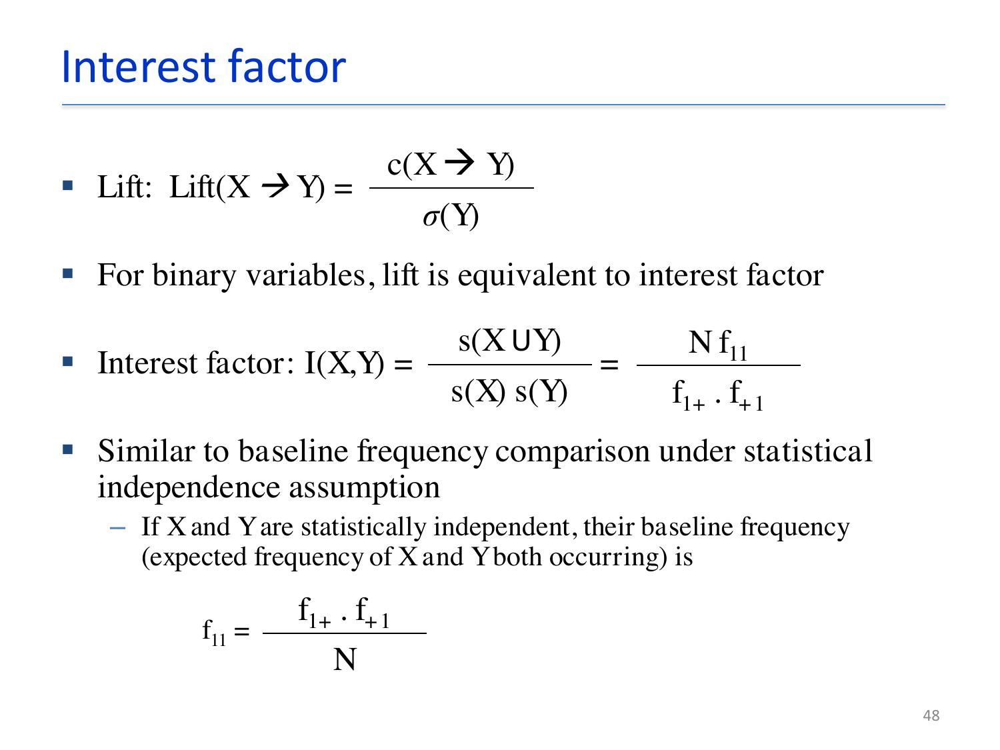

### Limits of lift and additional objective measures

Lift/interest factor is not inversion-invariant: it can rate a pair differently from the equivalent relationship between both items being absent. In the lecture comparison, $I(Text,Analysis)=1.02$ but $I(Graph,Mining)=4.08$, even though the contingency tables have the same association structure under inversion. Thus lift alone can be misleading.

For a binary contingency table, the **phi correlation coefficient** is:

$$\phi=\frac{f_{11}f_{00}-f_{01}f_{10}}{\sqrt{f_{1+}f_{+1}f_{0+}f_{+0}}}.$$

The **IS measure** combines interest and support:

$$IS(A,B)=\sqrt{I(A,B)\times supp(A,B)}=\frac{supp(A,B)}{\sqrt{supp(A)supp(B)}}.$$

It is mathematically equivalent to cosine similarity for binary variables.

Two useful properties for an objective measure are:

- **Inversion property:** its value is unchanged when $f_{11}$ is exchanged with $f_{00}$ and $f_{01}$ with $f_{10}$.
- **Null-addition property:** its value is unchanged when $f_{00}$ increases—adding transactions containing neither item should not change their association.
